# Entity Relationship Diagram — EcoLife Hub

```mermaid
erDiagram
    users {
        bigint id PK
        string name
        string email UK
        timestamp email_verified_at
        string password
        string remember_token
        decimal weight_kg
        int height_cm
        string city
        string profile_photo_path
        int quiz_score
        timestamp created_at
        timestamp updated_at
    }

    daily_histories {
        bigint id PK
        bigint user_id FK
        date history_date
        int quiz_score
        int activity_minutes
        int activity_calories
        timestamp created_at
        timestamp updated_at
    }

    activity_logs {
        bigint id PK
        bigint user_id FK
        string activity_type
        string pace_intensity
        int duration_minutes
        decimal distance_km
        int calories_burned
        decimal weight_kg
        date activity_date
        text notes
        timestamp created_at
        timestamp updated_at
    }

    nutrition_logs {
        bigint id PK
        bigint user_id FK
        string food_name
        decimal calories
        decimal protein_g
        decimal carbs_g
        decimal sugar_g
        decimal fat_g
        string meal_type
        string image_url
        string source
        datetime logged_at
        timestamp created_at
        timestamp updated_at
    }

    articles {
        bigint id PK
        string title
        string slug UK
        string category
        string language
        text excerpt
        longtext content
        string image_url
        string source_url
        string author
        bool is_published
        timestamp published_at
        timestamp created_at
        timestamp updated_at
    }

    comments {
        bigint id PK
        bigint user_id FK
        bigint article_id FK
        text body
        timestamp created_at
        timestamp updated_at
    }

    discussion_threads {
        bigint id PK
        bigint user_id FK
        string title
        text body
        string category
        bool is_pinned
        bool is_locked
        timestamp created_at
        timestamp updated_at
    }

    discussion_replies {
        bigint id PK
        bigint user_id FK
        bigint thread_id FK
        text body
        timestamp created_at
        timestamp updated_at
    }

    quiz_questions {
        bigint id PK
        string question
        json options
        string answer
        string topic
        timestamp created_at
        timestamp updated_at
    }

    sdgs {
        bigint id PK
        string title
        string image
        text description
        text importance
        string target1
        string target2
        string target3
        string action1
        string action2
        string action3
        timestamp created_at
        timestamp updated_at
    }

    achievements {
        bigint id PK
        string name
        text description
        tinyint level
        timestamp created_at
        timestamp updated_at
    }

    achievement_user {
        bigint achievement_id FK
        bigint user_id FK
        timestamp earned_at
        timestamp created_at
        timestamp updated_at
    }

    water_trackers {
        bigint id PK
        bigint user_id FK
        int target
        int progress
        date tracking_date
        timestamp created_at
        timestamp updated_at
    }

    permissions {
        bigint id PK
        string name
        string guard_name
        timestamp created_at
        timestamp updated_at
    }

    roles {
        bigint id PK
        string name
        string guard_name
        timestamp created_at
        timestamp updated_at
    }

    model_has_roles {
        bigint role_id FK
        string model_type
        bigint model_id
    }

    model_has_permissions {
        bigint permission_id FK
        string model_type
        bigint model_id
    }

    role_has_permissions {
        bigint permission_id FK
        bigint role_id FK
    }

    %% ========== RELATIONS ==========

    users ||--o{ daily_histories : has
    users ||--o{ activity_logs : has
    users ||--o{ nutrition_logs : has
    users ||--o{ comments : writes
    users ||--o{ discussion_threads : creates
    users ||--o{ discussion_replies : writes
    users ||--o{ water_trackers : tracks
    users }o--o{ achievements : unlocks
    users }o--o{ roles : has
    users }o--o{ permissions : has

    articles ||--o{ comments : has

    discussion_threads ||--o{ discussion_replies : contains

    achievements ||--o{ achievement_user : awarded_in
    users ||--o{ achievement_user : earns

    roles ||--o{ model_has_roles : assigned
    permissions ||--o{ model_has_permissions : assigned
    roles ||--o{ role_has_permissions : has
    permissions ||--o{ role_has_permissions : in
```

## Legend

| Table | Description |
|-------|-------------|
| `users` | Core user accounts (weight, height, city, photo, quiz score) |
| `daily_histories` | Per-day summary of quiz score + activity minutes/calories |
| `activity_logs` | User activity/exercise logs (type, duration, distance, calories) |
| `nutrition_logs` | Food/drink intake logs (calories, macros, meal type, source) |
| `articles` | Educational content (categorized, bilingual, published/draft) |
| `comments` | User comments on articles |
| `discussion_threads` | Forum threads (category, pinned, locked) |
| `discussion_replies` | Replies within discussion threads |
| `quiz_questions` | Quiz bank (question, JSON options, answer, topic) |
| `sdgs` | SDG educational content (targets, actions per goal) |
| `achievements` | Achievement/role tiers (name, description, level) |
| `achievement_user` | Pivot — which user earned which achievement |
| `water_trackers` | Water intake per user (deprecated/legacy) |
| `permissions` | Spatie permission package |
| `roles` | Spatie role package |
| `model_has_roles` | Polymorphic pivot: users <> roles |
| `model_has_permissions` | Polymorphic pivot: users <> permissions |
| `role_has_permissions` | Pivot: roles <> permissions |

## Notes

- `quiz_questions.options` is stored as JSON
- `model_has_roles` and `model_has_permissions` use Laravel polymorphic morphs (`model_type` + `model_id`)
- `achievement_user` has a composite primary key `(achievement_id, user_id)`
- All foreign keys use `cascadeOnDelete` except sessions (nullable)
- `water_trackers` table remains as legacy — feature removed from UI
