# Use Case Diagram — EcoLife Hub

```mermaid
graph TB
    Guest["Guest"]
    User["Authenticated User"]
    Admin["Administrator"]

    subgraph auth["Authentication & Account"]
        UC1["Register Account"]
        UC2["Login"]
        UC3["Logout"]
        UC4["View Welcome Page"]
        UC5["Switch Language"]
    end

    subgraph profile["Profile Management"]
        UC6["Edit Profile"]
        UC7["Upload Profile Photo"]
        UC8["Remove Profile Photo"]
        UC9["Input Body Data"]
        UC10["Delete Account"]
        UC11["Detect Location"]
    end

    subgraph nutrition["Nutrition Tracking"]
        UC12["Scan Food Label"]
        UC13["Search OpenFoodFacts"]
        UC14["Manual Food Input"]
        UC15["Confirm Scan Result"]
        UC16["View Nutrition History"]
        UC17["Delete Nutrition Log"]
    end

    subgraph activity["Activity Logging"]
        UC18["Log Activity"]
        UC19["Delete Activity"]
    end

    subgraph learning["Learning & Content"]
        UC20["Browse Articles"]
        UC21["Read Article"]
        UC22["Create Comment"]
        UC23["Delete Own Comment"]
        UC24["Browse SDG Content"]
    end

    subgraph community["Community Discussions"]
        UC25["Create Thread"]
        UC26["Reply to Thread"]
        UC27["Delete Own Thread"]
        UC28["Delete Own Reply"]
    end

    subgraph quiz["Quiz & Achievements"]
        UC29["Take Quiz"]
        UC30["View Quiz Result"]
        UC31["View Achievements"]
    end

    subgraph reporting["Reports"]
        UC32["View Dashboard"]
        UC33["View Daily Report"]
        UC34["View History Calendar"]
    end

    subgraph admin_panel["Admin Panel"]
        UC35["View Admin Dashboard"]
        UC36["Manage Articles CRUD"]
        UC37["View Users List"]
        UC38["View User Detail"]
        UC39["Manage Comments"]
        UC40["Pin Discussion Thread"]
        UC41["Lock Discussion Thread"]
        UC42["Delete Discussion Thread"]
        UC43["Manage Quiz Questions CRUD"]
        UC44["View Platform Statistics"]
    end

    Guest --> UC1
    Guest --> UC2
    Guest --> UC4
    Guest --> UC5

    User --> UC3
    User --> UC5
    User --> UC6
    User --> UC7
    User --> UC8
    User --> UC9
    User --> UC10
    User --> UC11
    User --> UC12
    User --> UC13
    User --> UC14
    User --> UC15
    User --> UC16
    User --> UC17
    User --> UC18
    User --> UC19
    User --> UC20
    User --> UC21
    User --> UC22
    User --> UC23
    User --> UC24
    User --> UC25
    User --> UC26
    User --> UC27
    User --> UC28
    User --> UC29
    User --> UC30
    User --> UC31
    User --> UC32
    User --> UC33
    User --> UC34

    Admin --> UC35
    Admin --> UC36
    Admin --> UC37
    Admin --> UC38
    Admin --> UC39
    Admin --> UC40
    Admin --> UC41
    Admin --> UC42
    Admin --> UC43
    Admin --> UC44
```

## Use Case Summary

| Code | Use Case | Actor |
|------|----------|-------|
| UC1 | Register Account | Guest |
| UC2 | Login | Guest |
| UC3 | Logout | User |
| UC4 | View Welcome Page | Guest |
| UC5 | Switch Language | Guest, User |
| UC6 | Edit Profile | User |
| UC7 | Upload Profile Photo | User |
| UC8 | Remove Profile Photo | User |
| UC9 | Input Body Data | User |
| UC10 | Delete Account | User |
| UC11 | Detect Location | User |
| UC12 | Scan Food Label | User |
| UC13 | Search OpenFoodFacts | User |
| UC14 | Manual Food Input | User |
| UC15 | Confirm Scan Result | User |
| UC16 | View Nutrition History | User |
| UC17 | Delete Nutrition Log | User |
| UC18 | Log Activity | User |
| UC19 | Delete Activity | User |
| UC20 | Browse Articles | User |
| UC21 | Read Article | User |
| UC22 | Create Comment | User |
| UC23 | Delete Own Comment | User |
| UC24 | Browse SDG Content | User |
| UC25 | Create Thread | User |
| UC26 | Reply to Thread | User |
| UC27 | Delete Own Thread | User |
| UC28 | Delete Own Reply | User |
| UC29 | Take Quiz | User |
| UC30 | View Quiz Result | User |
| UC31 | View Achievements | User |
| UC32 | View Dashboard | User |
| UC33 | View Daily Report | User |
| UC34 | View History Calendar | User |
| UC35 | View Admin Dashboard | Admin |
| UC36 | Manage Articles CRUD | Admin |
| UC37 | View Users List | Admin |
| UC38 | View User Detail | Admin |
| UC39 | Manage Comments | Admin |
| UC40 | Pin Discussion Thread | Admin |
| UC41 | Lock Discussion Thread | Admin |
| UC42 | Delete Discussion Thread | Admin |
| UC43 | Manage Quiz Questions CRUD | Admin |
| UC44 | View Platform Statistics | Admin |
